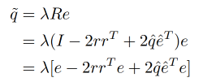

# Restructuring Vector Quantization with the Rotation Trick

**Restructuring Vector Quantization with the Rotation Trick**  
Christopher Fifty, Ronald G. Junkins, Dennis Duan, Aniketh Iger, Jerry W. Liu, \
Ehsan Amid, Sebastian Thrun, Christopher Ré\
Under Review\
[arXiv](https://arxiv.org/abs/xxxx.yyyyy)

## Note
Copying origin repo from [link](https://github.com/cfifty/rotation_trick). Thanks for this interesting work!


The intention of this repo is to modify the original code to make it work on local machine and to **help us to better understand VQ-VAE architecture and the rotation trick**.

Basically, I modified the code as follows:
1. Pre-download imagenet10 dataset instead of the whole imagenet dataset.
2. Modify the multi-node code to make it work on local machine.
3. Simplify encoder and decoder for clear computation graph.
4. Modify some notation to align with the original paper.


## Core of the **rotation trick** is in `model/vq_vae`:
```python
def get_very_efficient_rotation(e_hat, q_hat, e):
    r = ((e_hat + q_hat) / torch.norm(e_hat + q_hat, dim=1, keepdim=True)).detach()
    e = e - 2 * torch.bmm(torch.bmm(e, r.unsqueeze(-1)), r.unsqueeze(1)) + 2 * torch.bmm(
      torch.bmm(e, e_hat.unsqueeze(-1).detach()), q_hat.unsqueeze(1).detach())
    return e

b, c, h, w = x.shape
x = rearrange(x, 'b c h w -> (b h w) c')
quantized = rearrange(quantized, 'b c h w -> (b h w) c')
pre_norm_q = self.get_very_efficient_rotation(x / (torch.norm(x, dim=1, keepdim=True) + 1e-6),
                                            quantized / (torch.norm(quantized, dim=1, keepdim=True) + 1e-6),
                                            x.unsqueeze(1)).squeeze()
quantized = pre_norm_q * (
        torch.norm(quantized, dim=1, keepdim=True) / (torch.norm(x, dim=1, keepdim=True) + 1e-6)).detach()
quantized = rearrange(quantized, '(b h w) c -> b c h w', b=b, h=h, w=w)
```

It is corresponding to:



in origin paper, where $\lambda, r, \hat{e}, \hat{q}$ are all stop-gradient values. 

## EMA Update in VectorQuantization
For **vector quantization** part, this repo (in my view) refers to the implementation of [vector-quantize-pytorch](https://github.com/lucidrains/vector-quantize-pytorch) and here I remove some unnecessary parts, such as orthogonal loss and diversity loss.

The EMA update is implemented in `vector_quantize_pytorch.py` as follows:
```python

dist = -cdist(flatten, embed)

embed_ind, embed_onehot = self.gumbel_sample(dist, dim=-1, temperature=sample_codebook_temp, training=self.training)

unpacked_onehot = unpack_one(embed_onehot, ps, 'h * c')
quantize = einsum('h b n c, h c d -> h b n d', unpacked_onehot, embed)

cluster_size = embed_onehot.sum(dim=1)
```
+ `embed_onehot` is a tensor of shape [`num_codebooks`, `batch_size`, `codebook_size`]
+ `embed_onehot.sum(dim=1)` is a tensor of shape [`num_codebooks`, `codebook_size`] tells us **how many times each codebook vector is used** in the current batch assigned to each code.

```python
ema_inplace(self.cluster_size.data, cluster_size, self.decay)
```
+ this updates the “historical” cluster sizes, rather than overwriting them with just the current batch.

```python
embed_sum = einsum('h n d, h n c -> h c d', flatten, embed_onehot)
ema_inplace(self.embed_avg.data, embed_sum, self.decay)
```
+ for each code `c`, we sum the vectors `d` for which the one-hot is active.
+ the result is `[h, c, d]`, i.e. a **sum** of all sample vectors assigned to each code.

```python
embed_normalized = self.embed_avg / rearrange(cluster_size, '... -> ... 1')
self.embed.data.copy_(embed_normalized)
```
+ by dividing the historical sum of vectors (self.embed_avg) by the (smoothed) cluster sizes, we can get the new average vector for each code

## Approach

In the context of VQ-VAEs, the rotation trick smoothly transforms each encoder output into its corresponding codebook
vector via a rotation and rescaling linear transformation that is treated as a constant during backpropagation. As a
result, the relative magnitude and angle between encoder output and codebook vector becomes encoded into the gradient as
it propagates through the vector quantization layer and back to the encoder.


## Code environment

This code requires Pytorch 2.3.1 or higher with cuda support. It has been tested on Ubuntu 22.04.4 LTS and python 3.8.5.

You can create a conda environment with the correct dependencies using the following command lines:

```
cd rotation_trick
conda env create -f environment.yml
conda activate rotation_trick
```

## Setup

The directory structure for this project should look like:

```
Outer_Directory
│
│───rotation_trick/
│   │   src/
│   │   ...
│
│───imagenet10/
│   │   train/
│   │   |   ...
│   │   val/
│   │   |   ...
```

## Training a Model

Follow the commands in ```src/scripts.sh```.
